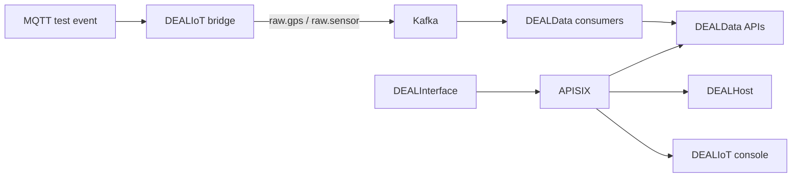

# ArchiDEAL

ArchiDEAL is the operational monorepo for the DEAL suite. It contains coordinated snapshots of
DEALIoT, DEALHost, DEALData, and DEALInterface, a compact development stack, and a hardened
Kubernetes production reference that keeps their communication contracts in one release boundary.

> **Status:** `compose.yaml` remains development-only. The supported production target is the
> operator-only, single-tenant Kubernetes baseline under `deploy/kubernetes`, with external HA
> data services, TLS, OIDC, external secrets and digest-pinned images. A concrete environment is
> not a GO until every gate in [docs/production-readiness.md](docs/production-readiness.md) has
> recorded evidence.

## Repository layout

```text
components/
  DEALIoT/        MQTT ingestion, Kafka contracts, management console and full IoT platform
  DEALHost/       module registry, discovery and APISIX route publication
  DEALData/       Core, GPS and Sensor persistence services and Kafka consumers
  DEALInterface/  same-origin React control plane
deploy/apisix/    traditional APISIX configuration and idempotent route bootstrap
deploy/kubernetes production renderer, base and multi-AZ production overlay
docs/             architecture, deployment and migration decisions
scripts/          environment bootstrap, validation and end-to-end smoke test
compose.yaml      compact integration stack
sources.lock.json imported source revisions
```

The source repositories remain the historical provenance for commits made before this migration.
The exact imported revisions are recorded in `sources.lock.json`; new coordinated work should be
made in ArchiDEAL after the migration pull request is accepted.

## Communication path



Only APISIX is published to the host. Prefixes are removed before forwarding, so the browser uses a
single origin while each backend receives its native path. DEALHost and the bootstrap job both use
the APISIX Admin API in traditional/etcd mode.

## Quick start

Prerequisites: Docker Engine with Compose v2, Python 3.12 or newer, OpenSSL, and enough resources to
build the Rust and Python images.

```bash
make bootstrap
make validate
make up
make smoke
```

Open `http://127.0.0.1:8080`. Change `ARCHIDEAL_HTTP_PORT` in `.env` if necessary.

The compact stack stores DEALIoT device configuration in its dedicated
`dealiot-registry-db` volume and applies schema migrations before starting the console. Existing
installations whose `.env` predates the registry must add a new random credential before running
Compose again:

```bash
printf '\nDEALIOT_REGISTRY_DATABASE_PASSWORD=%s\n' "$(openssl rand -hex 32)" >>.env
chmod 600 .env
```

Do not rerun `make bootstrap` over an existing `.env`; the bootstrap script intentionally refuses
to overwrite existing credentials.

The smoke test first registers, updates and retires a device through APISIX, including a stale-ETag
write that must return `412`, to validate the DEALIoT PostgreSQL migration, persistence and
concurrency contract. It then publishes GPS and sensor messages over MQTT, waits for the DEALIoT
bridge to place them on Kafka, verifies DEALData persistence through APISIX, and replays one message
to confirm idempotency.

```bash
make ps
make logs
make down
```

`make down` preserves volumes. Remove volumes manually only when their data is no longer needed.

## What the monorepo fixes

- one compatibility change can update producer, consumer, route and UI contracts atomically;
- the integration stack has no host-port collision and publishes only APISIX;
- service DNS and networks are explicit;
- APISIX uses one coherent traditional/etcd mode with path-prefix rewriting;
- DEALInterface is built and served as a production-style static container behind the same origin;
- DEALData consumers can be configured for Kafka PLAINTEXT, SSL, SASL_PLAINTEXT or SASL_SSL;
- the PyFlink dependency is aligned with the Flink 2.2.1 runtime;
- root CI replaces the inactive nested repository workflows for coordinated changes.

See [docs/architecture.md](docs/architecture.md), [docs/deployment.md](docs/deployment.md),
[docs/supply-chain.md](docs/supply-chain.md), and
[docs/production-readiness.md](docs/production-readiness.md) before changing ownership or release
processes. The production overlay includes Prometheus Operator discovery and alert rules; its
measured indicators and deliberate coverage gaps are tracked in [docs/slo.md](docs/slo.md), with
actions in [the observability runbook](docs/runbooks/observability-alerts.md).

A guarded [cron update wrapper](deploy/vps/README.md) is available for the development/integration
Compose stack on a single-node VPS. It does not replace the signed Kubernetes production flow.

## Licensing

The root repository and all four imported components are licensed under AGPL-3.0. Component license
files are retained for traceability.
