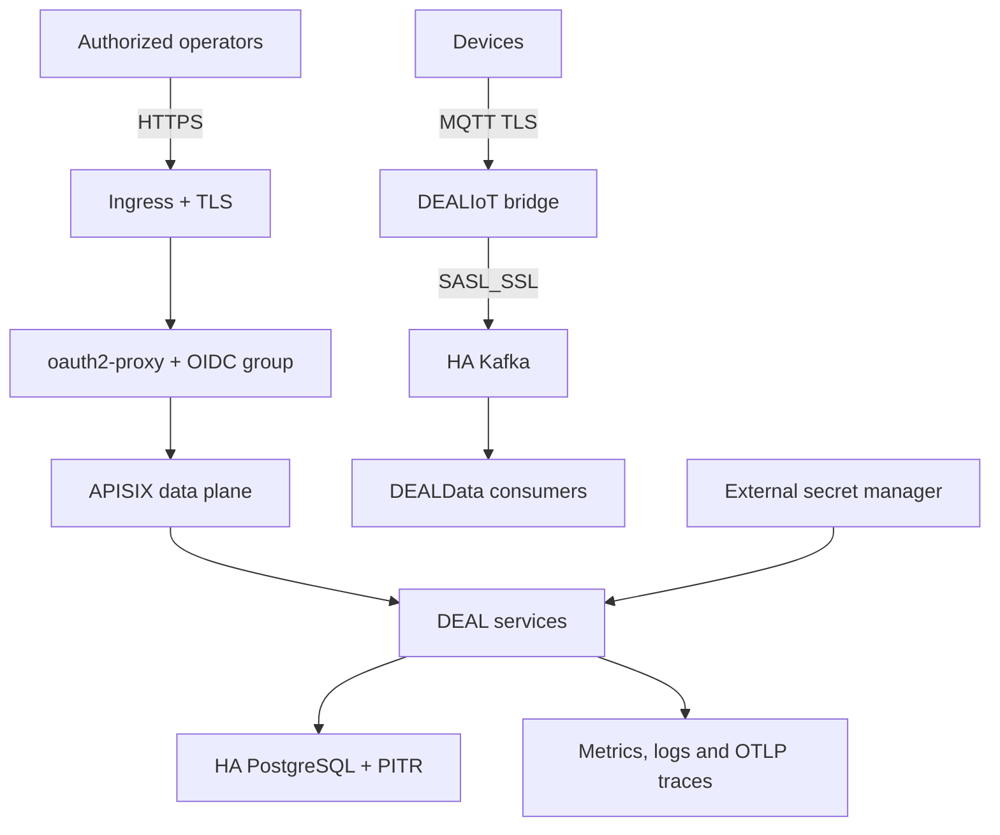

# Production readiness contract

## Supported profile

ArchiDEAL supports one production reference: Kubernetes across at least three failure zones, for a
single tenant and a restricted operator group. Kafka, MQTT, PostgreSQL, Valkey and etcd are external
HA dependencies. `compose.yaml`, the legacy component Compose files and Docker Swarm are not
production targets for the unified architecture.

The repository can make a deployment reproducible and fail closed, but it cannot certify a cluster,
identity provider, secret manager or backup system it cannot access. Production status is therefore
an evidence-backed decision for one rendered release in one environment.

## Required architecture

## Go-live gates

All rows require a linked evidence artifact, owner and date. A missing or expired artifact is a
NO-GO.

| Gate | Minimum evidence |
| --- | --- |
| Release identity | Verified Sigstore bundle, Git commit, exact policy hash, rendered manifest hash and ten image digests |
| Supply chain | Signed manifest and hashed evidence package; SBOM, provenance, signature, signed attestations and blocking scan per first-party image; minimum-version review, registry tag-to-digest proof, runtime compatibility output, independent SBOM and blocking scan for APISIX and oauth2-proxy |
| Secret generation | Release-scoped `CreatedOnce` runtime Secret patched and verified with native `immutable: true`, every Pod/Job bound to the same release name, staged credential overlap, and a tested new-release rotation/old-release rollback |
| TLS and identity | Valid public chain, OIDC issuer/audience/group tests, secure cookie inspection, and a `rediss://` Valkey session URL validated against the approved host and TLS port |
| Authorization | Anonymous rejection, distinct `OIDC_ALLOWED_GROUP` admission/read and `OIDC_ADMIN_GROUP` write groups, read-only denial of writes, and dual-membership administrator access tests |
| Network isolation | Pre-mutation Ready ingress-nginx Pod identity/IP-to-proxy-CIDR proof, in-cluster all-answer private DNS-to-CIDR proof, default-deny plus negative pod-to-pod and Admin API connectivity tests |
| Kafka | Three brokers, RF=3, min ISR=2, SASL_SSL and principal/topic/group ACL tests |
| MQTT | Three nodes, TLS, device/bridge identities and topic ACL tests |
| PostgreSQL | HA, `verify-full`, PITR and restore proof for DEALHost, all DEALData databases and the dedicated DEALIoT device registry; distinct registry DDL/runtime roles and secrets; release-scoped registry migration completed |
| APISIX/etcd | Private Admin API, authenticated TLS etcd quorum and snapshot restoration; exact dynamic upstreams matched to Services/NetworkPolicy, bootstrap-path collision rejection and proof that no unrevokable dynamic route is enabled |
| Availability | PDB, zone spread, resource limits and loss-of-pod/node/zone tests |
| Observability | Prometheus Operator selectors active, gateway RED metrics, consumer health/outcomes, external Kafka lag/database/certificate/backup exporters, DLQ/errors, logs, traces and paging test |
| Durable audit | Transactional mutation record or outbox, durable retained sink, actor/request correlation, access controls, failure recovery and restore/query evidence; best-effort Core NATS notifications are not audit evidence |
| SLO | Staging calibration and accepted error budgets from `docs/slo.md` |
| Data path | Authenticated DEALIoT registry create/update/stale-ETag/retire cleanup plus MQTT-to-PostgreSQL test, both event types and idempotent replay |
| Recovery | Application rollback plus backup/restore and regional DR exercises |

## Initial service objectives

- public operator edge availability: 99.9% over a rolling 30-day window;
- accepted event durability: 99.9%, with MQTT-to-DEALData persistence freshness p95 below 60 seconds;
- no acknowledged event loss during a single-zone failure;
- PostgreSQL RPO at most five minutes and RTO at most sixty minutes;
- etcd RPO at most one hour and RTO at most thirty minutes.

These are starting objectives, not observed claims. Calibrate alerts with staging and production
telemetry before contractual use.

The repository ships monitors and alert rules only for metrics that the current workloads expose.
The explicit partial and missing indicators in `docs/slo.md` remain NO-GO items until the target
environment supplies and tests them; the presence of Prometheus Operator CRDs alone is not evidence
of observability readiness.

## Temporary MQTT client supplier exception

The Rust bridge currently imports the MQTT 3.1.1 client from the published
`rumqttc-v4-next` 0.33.2 package. This is a temporary, named supplier exception: the previous
`rumqttc` release pins a vulnerable `rustls-webpki` line, while the upstream remediation
[remains unmerged](https://github.com/bytebeamio/rumqtt/pull/1037) and does not yet select the first
version that fixes [RUSTSEC-2026-0104](https://rustsec.org/advisories/RUSTSEC-2026-0104.html).
The replacement package is maintained in a personal fork and is not a strategic dependency.

A production GO therefore additionally requires all of the following evidence:

- the committed Cargo lock resolves exactly `rumqttc-v4-next` 0.33.2 and
  `rustls-webpki` 0.103.13 or later, with no 0.102.x package, and every build uses `--locked`;
- the release SBOM and blocking vulnerability scan cover the bridge dependency graph;
- staging proves private-CA TLS, mutual TLS when enabled, reconnect, SUBACK, QoS 1 manual
  acknowledgement and Kafka recovery behavior;
- the platform owner records a quarterly supplier review, owner and exit date in the third-party
  risk register;
- the exception is removed when a maintained upstream or successor MQTT 3.1.1 release provides the
  required fixed TLS dependency and passes the same integration suite.

## Promotion and rollback

Build images once from the release commit. Promotion changes only the environment release record and
must retain identical digests from one `release-manifest.json`. `verify-release.py` must pass before
rendering or contacting Kubernetes; no manual digest substitution or verification bypass is
permitted. Database changes use expand/contract migrations through release-named
Jobs; application pods never migrate on startup. Rollback restores the previous manifest without a
destructive schema downgrade. If compatibility cannot be maintained, stop and restore according to
the backup runbook instead of forcing the rollout. The promotion fence must prove the active
Ingress, all eleven controller templates and all Ready serving Pods share one release before any
mutation. Any later failure must leave the Ingress absent and Namespace state `failed`; only
`production-rollback` with the recorded previous signed manifest, Sigstore bundle and evidence may
restore traffic. A GO record requires matching `succeeded`, active-release and promotion-release
annotations on the Namespace and Ingress after the final coherence check.

Runtime secret rotation is also a release promotion. Never change the provider values and retry the
same `RELEASE_ID`: its `CreatedOnce` Secret is intentionally reused. Create a new release ID after
the old and new credentials are simultaneously accepted, roll forward, verify the authenticated
data path, and retain the previous release-scoped Secret until rollback is no longer authorized.

## Explicit exclusions

- anonymous public access;
- multi-tenant data visibility or tenant-scoped RBAC;
- production deployment from Compose;
- plaintext Kafka, MQTT, PostgreSQL, Valkey or etcd;
- mutable image tags or credentials committed in Git;
- a go-live based only on static manifest validation.
- dynamic APISIX module routes while route state, conditional revocation and durable audit are not
  implemented; the production baseline remains bootstrap-only and every current module manifest
  stays `production_ready=false`.
